# Meatball

A pixel-art meatball that lives above the prompt in Claude Code, in the desktop app and the terminal, and shows what Claude is doing at a glance.



<sub>Also as a [GIF](docs/poses.gif) for places that won't play an SVG. Regenerate it with `python3 docs/make-poses-gif.py` after changing the sprite.</sub>

| He… | When |
|---|---|
| rolls along the bar | Claude is thinking or reading |
| chomps | Claude edits a file |
| stands with a focused face | a command is running |
| winces and shakes | a tool fails |
| hops and blinks | Claude is waiting on you (permission, question, plan approval) |
| does a happy hop | the turn is done |
| dozes off | nothing has happened for 5 minutes |
| gets rounder | the context window passes 50%, then 80% (time to `/compact`) |

## Install

Needs Claude Code 2.1.288 or newer. In the desktop app he's drawn from the 32×32 SVG; in a terminal he's a 16×16 version painted in colored half-block characters, 16 columns by 8 rows, so he works in Terminal.app, iTerm2 and the rest (he steps aside when the terminal is too short to fit him).

```bash
claude plugin marketplace add jesseorndorff/meatball
claude plugin install meatball@meatball
```

Then start a new session.

To hack on him, clone the repo and add your local copy instead, so your changes load without pushing:

```bash
git clone https://github.com/jesseorndorff/meatball.git
claude plugin marketplace add ./meatball
claude plugin install meatball@meatball
```

## Commands

- `/meatball` hides him or brings him back
- `/meatball width <px>` pins the bar's width; `/meatball width auto` fits it to the window again

## Updating after a change

1. Bump `version` in `plugin/.claude-plugin/plugin.json`
2. `claude plugin marketplace update meatball`
3. `claude plugin update meatball@meatball`, then start a new session

## Layout

- `.claude-plugin/marketplace.json`: the one-plugin marketplace
- `plugin/hooks/register.tsx`: the mod
- `plugin/hooks/terminal.ts`: paints the 16×16 sprite into terminal cells
- `plugin/assets/meatball.svg`, `plugin/assets/meatball-16.svg`: the sprites (desktop, terminal)
- `plugin/hooks/meatball.ts`, `plugin/hooks/sprite16.ts`: generated from the sprites by `python3 scripts/build-sprites.py`
- `plugin/types/index.d.ts`: the state contract

Run the tests with `claude plugin test plugin` and check the manifests with `claude plugin validate .`

## License

[MIT](LICENSE) © 2026 Jesse Orndorff
